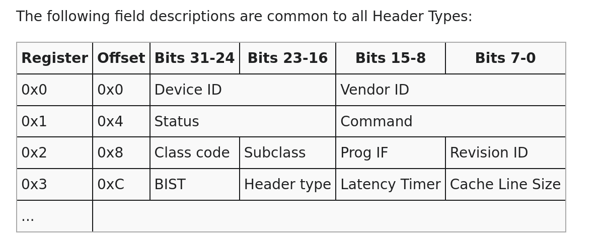

So the tutorial i was following along ended in the last part and now i am free styling meaning i will be making a whole lot of mistakes 
first make a .img disk using qemu-img switch make file to first output the os image to this disk and use this diskimg as drive instead of the os-image.bin directly 
now we need to make a driver i will start with a ATA device and hopefully later upgrade it to use PCI Express controller for the drive (Final goal Nvme SSD)

before we can make a disk driver we need to initialise the PCI BUS for backwards compatibility for my project its unnecessary because i will be using qemu to simulate hardware so i dont need backward compatibility but i will still do this if only to learn more about PCI config spaces

PCI Bus provides a purely software initialisation for any device on the PCI Bus via the Configuration Address Space 
All devices on the bus first provide 256 bytes of configuration registers for this
these registers are inside the pci device itself we read and write to this configuration space via the 
PCI CONFIG_ADDRESS(0xCF8) and PCI CONFIG_DATA (0xCFC)

Config Address layout (32 bit) :
bit 31: enable bit must be 1 to access read or write if 0 nothing happens
bit 30 - 24: must be 0 
bit 23-16: Bus number 
bit 15-11 : device number / slot 
bit 10-8: function number
bit 7-2: register number / offset baically we can only have offset 4bytes at a time thats why last 2 bit must be 0 this is because we must read a full register that is 4 bytes long 
bit 1-0: alwasy 0 for 4 bit alignment

make a config space controller to do this it is simply sending the bytes to the port and reciving it on the config data with a little bit of bit manipulation

we will need to scan every device and execute the corrosponding function for that device so we need to enmurate through all of em we can just brute force this in our case we will do it by checking all function 0s of all the devices another way is to do a recursive scan to see if its a pci pci bus and scan everything in that bus we dont need that right now I will change this later as i upgrade 

add a check all busses function to loop through all 

now to add functions for our PATA IDE drive 

